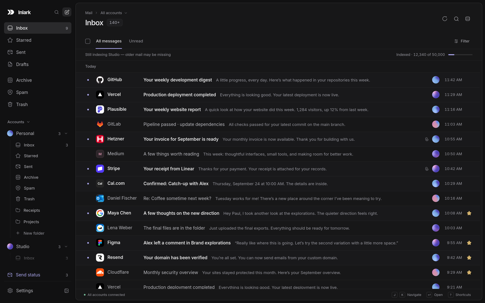
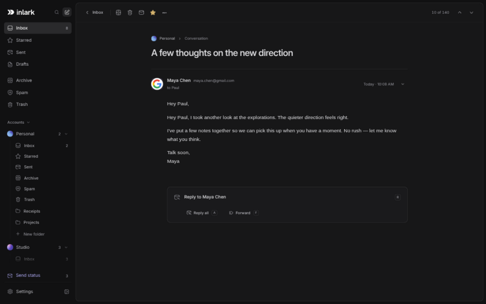
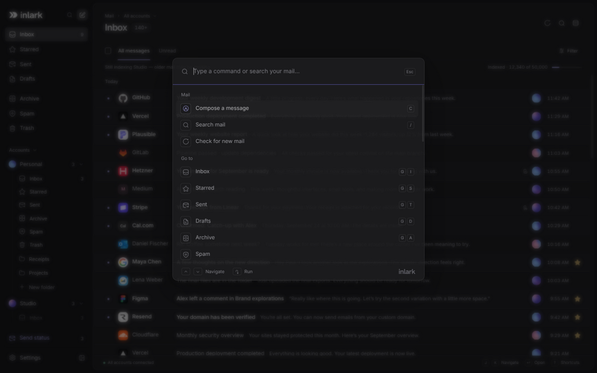

<div align="center">


<h1>
  <picture>
    <source media="(prefers-color-scheme: light)" srcset=".github/assets/wordmark-light.svg" />
    
  </picture>
</h1>

**Beautiful email. For everyone.**

A fast, keyboard-first desktop mail client for the accounts you already own.<br />
JMAP and IMAP, Linux, Windows and macOS. No hosted service, no subscription, no telemetry.

[**Download**](https://github.com/inlark/inlark/releases/latest) · [Features](#why-inlark) · [Connect an account](#connect-an-account) · [Build from source](#build-from-source)

</div>

<br />

<picture>
  <source media="(prefers-color-scheme: light)" srcset=".github/assets/inbox-light.png" />
  
</picture>

## Why Inlark?

If you run your own mail server, or just have a few accounts at small providers, your choices are usually an email client that looks like it was designed for Windows XP, one that wants a monthly fee, or one that routes your mail through someone else's cloud. Inlark is the fourth option: a calm, modern client that talks straight to your server and then gets out of the way.

- **One inbox for every account.** Personal, work and the side project you swear you'll finish all land in one timeline, each marked with its account. Replies go out from the address the message was sent to, so you stop accidentally emailing your landlord from your work address.
- **Your keyboard, first.** `J`/`K` to move, `E` to archive, `R` to reply, `/` to search, and `Ctrl K` for everything else. Every action works with a mouse, too.
- **Undo for everything.** Archive, trash, move, star or mark as spam, then press `Z`. It works even if another client changed the mailbox in between.
- **Search that goes all the way back.** Searches run on your server across every folder and every year, narrowed by sender, recipient, subject, date or attachment.
- **Big mailboxes stay fast.** A quarter of a million conversations in the unified inbox still scroll smoothly, because only the few dozen on screen are ever drawn.
- **Sending you can trust.** Drafts survive crashes. If a send's response gets lost on the way back, Inlark marks the message **unconfirmed** and doesn't retry it on its own, so nobody gets your message twice.
- **Private by design.** Inlark connects directly to your mail server. There's no Inlark account, no sync service and no analytics.
- **Dark and light, with equal care.** Both themes get the same attention to detail, and rich HTML mail keeps the look its sender designed.
- **At home on your desktop.** Native notifications, a tray icon with your unread count, and Inlark can be your default `mailto:` handler.

<table>
  <tr>
    <td width="50%"></td>
    <td width="50%"></td>
  </tr>
  <tr>
    <td align="center"><sub>A focused reader, without the clutter</sub></td>
    <td align="center"><sub><code>Ctrl K</code>: every action, folder and account in a few keystrokes</sub></td>
  </tr>
</table>

> [!NOTE]
> Inlark is an **early preview**. The everyday essentials work, but it's young. Keep your server's webmail bookmarked for now, just in case.

## Install

Grab the latest build from the [releases page](https://github.com/inlark/inlark/releases/latest):

Packaged builds check for updates in the background. When an update downloads successfully, Inlark installs it after you quit, so it never interrupts your work. If the automatic update fails, Inlark links to the [download page](https://inlark.com/download) for a manual install.

| Platform | Download                                                   |
| -------- | ---------------------------------------------------------- |
| Windows  | Installer (x64)                                            |
| macOS    | DMG or ZIP, for both Apple Silicon and Intel               |
| Linux    | AppImage, `.deb` or `.rpm` (x64), or [Nix](#nix-and-nixos) |

The release workflow signs macOS builds and notarizes them with Apple. Older unsigned macOS builds
need a manual install of a signed release before automatic updates can work. Windows builds aren't
signed yet, so Windows may ask you to confirm before the first launch.

### Nix and NixOS

Install from the flake:

```sh
nix profile install 'github:inlark/inlark/v0.1.0#inlark'
```

Or enable the NixOS module in your flake configuration:

```nix
{
  inputs.inlark.url = "github:inlark/inlark/v0.1.0";

  outputs = { nixpkgs, inlark, ... }: {
    nixosConfigurations.my-host = nixpkgs.lib.nixosSystem {
      system = "x86_64-linux";
      modules = [
        inlark.nixosModules.default
        { programs.inlark.enable = true; }
      ];
    };
  };
}
```

The package includes the desktop entry, icon and `mailto:` handler, for x86_64 and aarch64 Linux. Leave out `/v0.1.0` to follow the default branch.

## Connect an account

Open **Settings → Accounts → Add account** and type your email address. Inlark looks up what your domain publishes and shows you the protocol, servers, ports and security it found **before** it asks for a password. **Set up manually** is always there if you prefer.

- **JMAP is preferred** when your server offers it. Inlark finds it through DNS SRV or `/.well-known/jmap`.
- **IMAP/SMTP** settings come from your domain's autoconfig file or DNS SRV records. Only if your domain publishes nothing does Inlark ask Thunderbird's public settings directory, and then it sends just the domain.
- **Encryption is required.** Inlark uses implicit TLS or required STARTTLS, always with certificate verification and never a plaintext fallback. Your password is never tried against a server you didn't choose.
- **Passwords go into your OS keyring** when one is available. Without a keyring, you decide whether to remember a login on this device. If you do, the password is stored unencrypted in an owner-only file.

IMAP accounts build a local index in the background, newest Inbox mail first. Until it catches up, lists tell you that older mail may be missing, and search still runs on the server. If your server can't do an action safely, such as a move without `MOVE` or `UIDPLUS`, Inlark turns it off and tells you why rather than guessing.

Gmail and Microsoft sign-in (OAuth) aren't supported yet.

## Build from source

You'll need Node 24 and pnpm 12.3.4.

```sh
pnpm install --frozen-lockfile
pnpm dev          # the desktop app
pnpm dev:web      # browser preview with sample mail, no real accounts
```

Add `?stress=1` to the browser preview's URL for five synthetic 50,000-message inboxes, or run `pnpm dev -- --demo` for a sample workspace in the desktop app. On NixOS, run `nix develop path:.` first. The shell provides a compatible Electron.

For release tags and the one-time Apple signing credentials, see [Desktop releases](docs/releasing.md).

<details>
<summary><b>Checks, packaging and releases</b></summary>

```sh
pnpm check             # formatting, types, tests and a production build
pnpm test:stalwart     # real JMAP, IMAP and SMTP against a disposable Stalwart server (Podman or CONTAINER_RUNTIME=docker)
nix build path:.       # Nix package in ./result/bin/inlark
pnpm package:linux     # AppImage, .deb and .rpm in apps/desktop/release
pnpm test:deb          # Debian packaging smoke test (Podman)
```

The Nix build is pinned by `flake.lock`, `pnpm-lock.yaml` and the dependency hash in `nix/package.nix`. After changing dependencies, replace that hash with the one Nix reports.

Pushing a `v<version>` tag runs the [release workflow](.github/workflows/release.yml), which builds every platform, checks the Nix flake and publishes a GitHub Release. The tag is the source of truth: CI sets the desktop package version from it before building, so no manual `package.json` version update is needed.

To smoke-test the Nix package without opening a window:

```sh
INLARK_DATA_DIR="$(mktemp -d)" ./result/bin/inlark --smoke-test --ozone-platform=wayland
```

Normal app data lives in Electron's `userData` directory, usually `~/.config/Inlark`.

</details>

<details>
<summary><b>How the repository is organised</b></summary>

| Location                    | What lives there                                                                                     |
| --------------------------- | ---------------------------------------------------------------------------------------------------- |
| `apps/desktop/src/main`     | Network access, credentials, drafts and the send journal, discovery, IMAP indexing, native lifecycle |
| `apps/desktop/src/preload`  | The small, validated bridge between the app and the system                                           |
| `apps/desktop/src/renderer` | The React app: lists, reader, composer, preferences                                                  |
| `apps/marketing`            | The Astro landing page, deployed as static Cloudflare Workers assets                                 |
| `packages/core`             | Platform-independent types, validation, search and merge logic                                       |
| `packages/jmap`             | The JMAP provider                                                                                    |
| `packages/imap`             | The IMAP/SMTP provider                                                                               |
| `packages/ui`               | Shared components and the Tailwind theme                                                             |
| `tests`                     | Domain, protocol, storage and real-server tests                                                      |

Built with Electron, React, TypeScript, Tailwind CSS, Base UI, TanStack and Turborepo.

</details>

## What's not here (yet)

Inlark tries to make everyday email excellent before adding more features. AI, snooze, scheduled sending, rules, calendars, a full address book and mobile apps are all deliberately out of scope for now. If you need your email client to also be your calendar, your CRM and your life coach, this isn't that client. Yet.

## Credits

Inlark stands on the shoulders of two products that showed how good software can feel:

- **[Linear](https://linear.app)**, for its restraint, clear hierarchy and obsessive attention to detail, the bar for Inlark's visual design.
- **[Superhuman](https://superhuman.com)**, for proving email can be fast, focused and driven from the keyboard, the bar for Inlark's workflows.

Inlark isn't affiliated with either. We just admire their work.

## License

Copyright © 2026 Paul Koeck. Inlark is free software under the [GNU Affero General Public License v3](LICENSE) (`AGPL-3.0-only`). The bundled Inter font is under the [SIL Open Font License](packages/ui/src/fonts/OFL.txt); the outlined Hanken Grotesk wordmark is also under the [SIL Open Font License](packages/ui/src/fonts/HankenGrotesk-OFL.txt).
